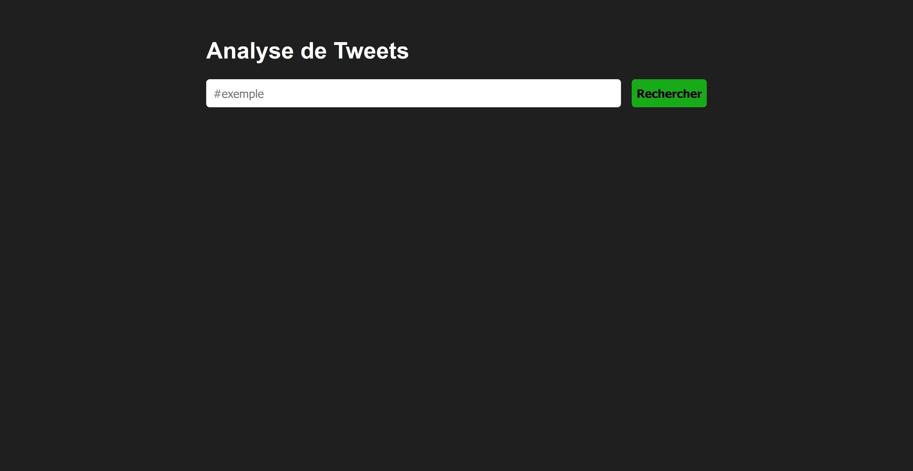
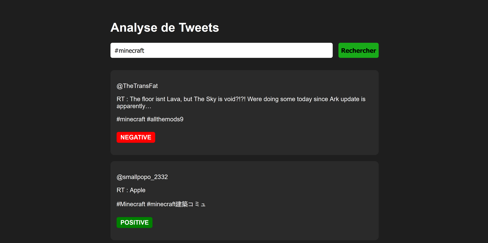
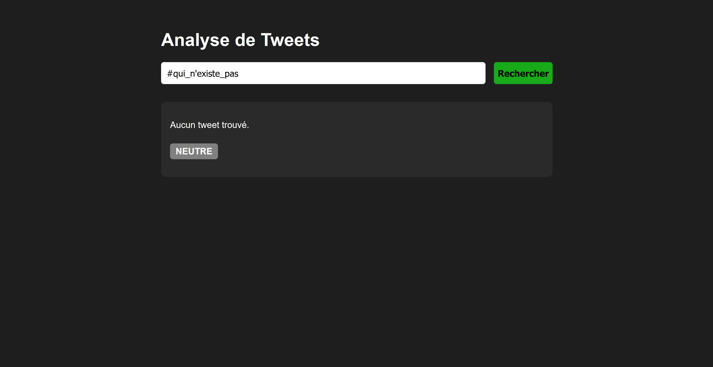

# Analyseur de Sentiments des Tweets

## Objectifs du projet

Ce projet vise à développer une application web permettant d’analyser les sentiments des tweets en temps réel. Les principales fonctionnalités incluent :

- Utilisation de l’API Twitter pour récupérer des tweets en fonction de mots-clés ou de hashtags.
- Intégration d’un modèle d’analyse de sentiment open-source via Hugging Face.
- Affichage des tweets et de leur classification (positif, négatif, neutre) dans une interface utilisateur.

## Fonctionnalités clés

- **Récupération des tweets** – Obtenir des tweets récents en fonction d' un # définis.
- **Analyse des sentiments** – Utiliser un modèle NLP de Hugging Face pour classifier les tweets.
- **Affichage interactif** – Présenter les tweets et leurs sentiments avec une interface utilisateur en React.
- **Filtrage et recherche** – Permettre aux utilisateurs de rechercher jusqu'a 10 tweets sur un sujet spécifique.

## Inventaire des librairies

| Nom de la bibliothèque | Utilité principale | Version utilisé |
|------------------------|--------------------|----------------------|
| **tweepy**             | API Twitter        | 4.15.0 |
| **transformers**       | Analyse NLP        | 4.39.3 |
| **flask**              | Serveur backend    | 3.1.0 |
| **flask-cors**         | CORS middleware    | 5.0.0 |
| **langdetect**         | Détection langue   | 1.0.9 |
| **React**              | Frontend UI        | 19.1.0 |
| **Vite**               | Dev server React   | 6.3.0 |

## Présentation des API

### transformers

- Utilisation du pipeline "sentiment-analysis" (modèle en anglais).
- Modèle : [distilbert-base-uncased-finetuned-sst-2-english](https://huggingface.co/distilbert/distilbert-base-uncased-finetuned-sst-2-english)

### facebook/m2m100_418M

- Utilisé pour traduire les tweets non anglophones avant l’analyse de sentiments.
- Modèle : [facebook/m2m100_418M](https://huggingface.co/facebook/m2m100_418M)

### tweepy

- Permet de récupérer les derniers tweets contenant un # défini.

## Problèmes potentiels

L’API gratuite de Twitter impose certaines limitations :

- 1 requête toutes les 15 minutes par utilisateur.
- Jusqu’à 100 posts récupérés et 500 écritures par mois.
- Même si la requête n’aboutit pas, elle est comptabilisée dans les 100 posts récupérés.

Plus d’informations : [Twitter Developer Portal](https://developer.x.com/en/portal/products)

### Étapes d'installation

```bash
# 1. Cloner le dépôt
git clone <URL_DU_PROJET>
cd <nom_du_dossier>

# 2. Installer le backend
cd backend
python3 app.py  # à lancer dans un terminal séparé

# 3. Installer le frontend
cd ../frontend
npm install
npm run dev
```

L'application sera accessible sur `http://localhost:5173` et communiquera avec le backend en `http://localhost:5000`.


### Screenshots de l'application






